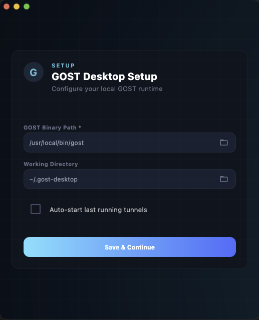
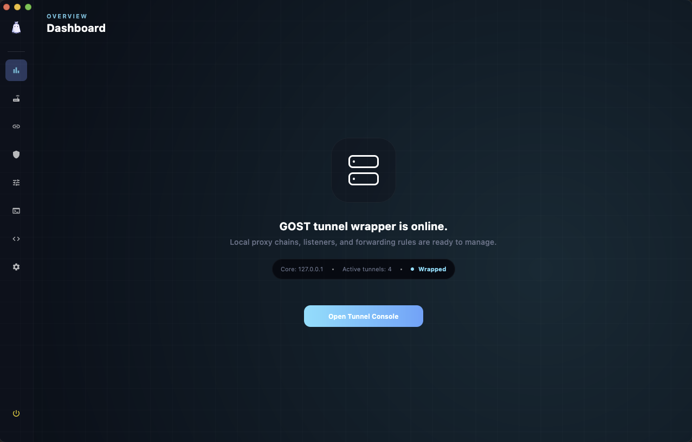
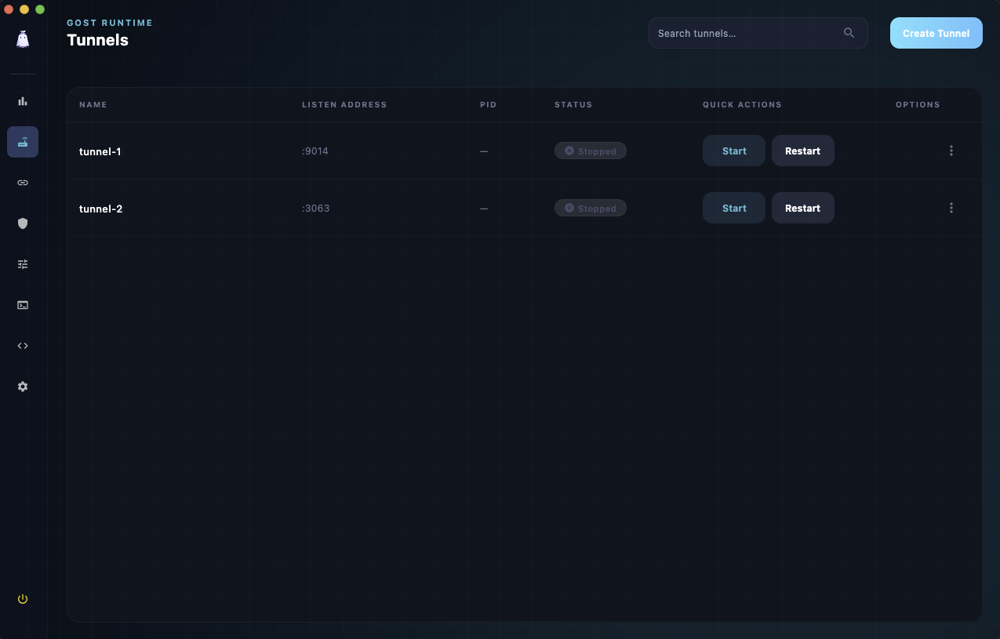
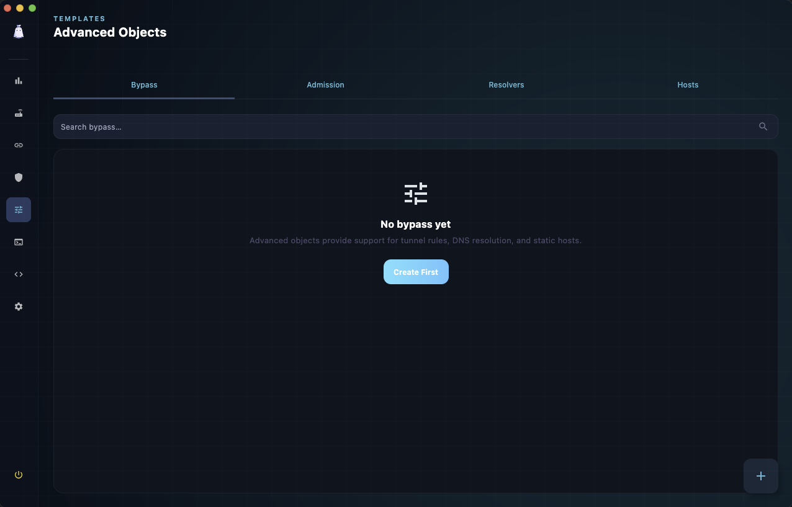
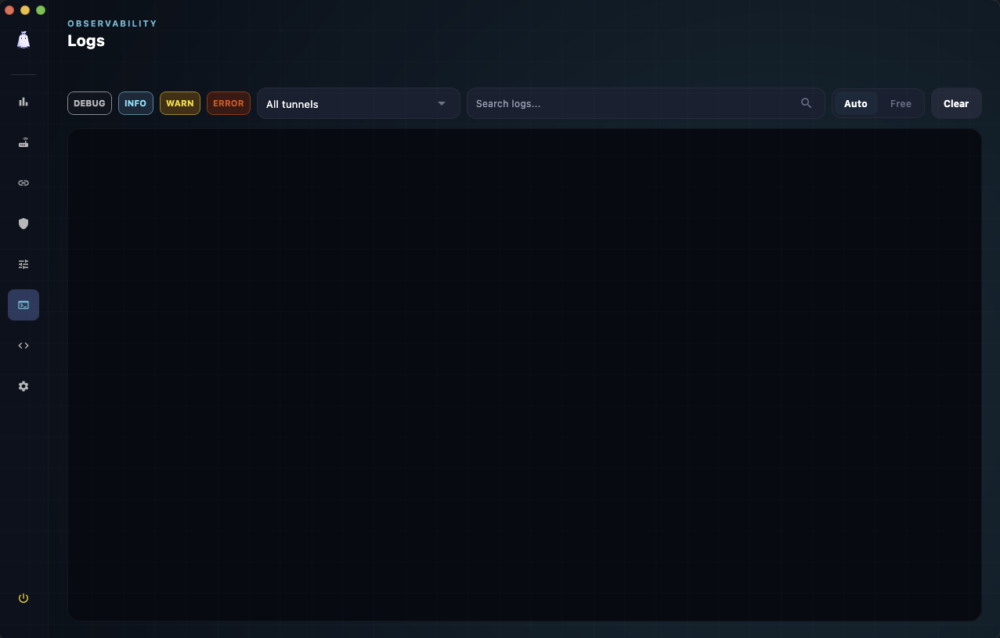
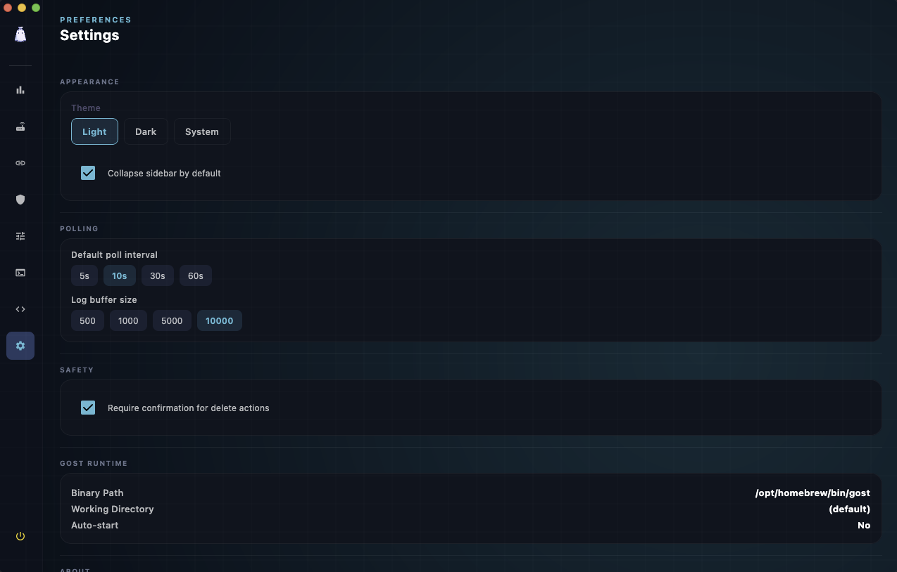

# GOST Desktop

[](https://github.com/imansprn/gost-desktop/actions/workflows/build.yml)
[](https://github.com/imansprn/gost-desktop/releases)
[](https://coveralls.io/github/imansprn/gost-desktop?branch=main)
[](LICENSE)
[](#)


Desktop application for managing a **[GOST](https://github.com/go-gost/gost)** instance through its HTTP API. This project is an **independent community client**; it is not affiliated with or endorsed by the upstream GOST maintainers unless they say otherwise.

## Features

- Connect to a GOST API with saved profiles and optional HTTP Basic credentials (passwords stored encrypted locally).
- Dashboard, services, chains, authers, advanced objects, metrics, logs placeholder, raw configuration editor, and settings.
- Material 3–style UI built with [Compose Multiplatform](https://www.jetbrains.com/compose-multiplatform/) for desktop (JVM).

## Preview

| 1. Setup & Connection | 2. Dashboard Overview | 3. Tunnels Management |
| :---: | :---: | :---: |
|  |  |  |

| 4. Advanced Objects | 5. Real-time Logs | 6. Application Settings |
| :---: | :---: | :---: |
|  |  |  |

## Requirements

- **JDK 21** (recommended) or another JDK compatible with **Kotlin 2.3** (see [gradle/libs.versions.toml](gradle/libs.versions.toml)).
- A running GOST instance reachable over the network, with its web/API enabled.

## Build and run

From the repository root:

```shell
./gradlew :composeApp:run
```

On Windows:

```shell
.\gradlew.bat :composeApp:run
```

Compile only:

```shell
./gradlew :composeApp:compileKotlinJvm
```

Run JVM tests:

```shell
./gradlew :composeApp:jvmTest
```

### Native installers

[composeApp/build.gradle.kts](composeApp/build.gradle.kts) configures `nativeDistributions` (DMG, MSI, Deb). Adjust `packageName` / `packageVersion` there for your fork. Current installer id: `xyz.gobliggg.gost`.

## Privacy and local data

The app stores configuration under your user home:

- **`~/.gost-manager/config.json`** — profiles, app settings, and references to saved credentials.
- **Encrypted passwords** — per-profile secrets are not stored in plaintext in that file (see `EncryptionUtil` in the codebase).

No telemetry or cloud sync is built into this repository; all traffic is between your machine and the GOST server you configure.

## License

Licensed under the **Apache License, Version 2.0** — see [LICENSE](LICENSE).

## Third-party software

This application depends on open-source libraries including Kotlin, Compose Multiplatform, Ktor, Voyager, and others resolved via Gradle. Their licenses apply to those components separately.

## Contributing

See [CONTRIBUTING.md](CONTRIBUTING.md). Participants are expected to follow the [Code of Conduct](CODE_OF_CONDUCT.md).
